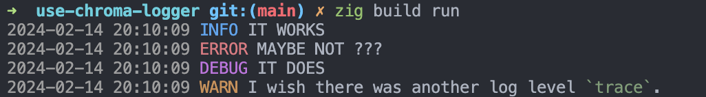

# Use Chroma Logger in Zig

Use Chroma Logger is a Zig project demonstrating the integration of a colorful logging library, Chroma, to enhance terminal outputs. It showcases the library's capabilities in providing flexible and dynamic string formatting with ANSI color codes.



> [!NOTE]
> The format of the timestamp is currently hardcoded to UTC+1 default format. This will be configurable in a future release.

## 🚀 Quick Start

Clone the repository and navigate into the project directory:

```
git clone https://github.com/adia-dev/use-chroma-logger.git
cd use-chroma-logger
```

Run the project using Zig:

```
zig build run
```

## 📦 Installation

This project requires Zig version 0.12.0-dev.2701+d18f52197 or newer. Ensure Zig is installed on your system and correctly set up in your path.

## 🛠️ Building

To build the project, simply run:

```bash
zig build
```

## 📝 Usage

After building, you can run the compiled executable directly:

```bash
zig build run
```

This will display colorful log messages in your terminal, demonstrating Chroma's capabilities.

## 🔧 Configuration

No additional configuration is needed to get started with this project. However, you can customize the build settings in `build.zig` as needed.

## 🧪 Running Tests

To run unit tests, execute:

```
zig build test
```

## 💡 Features

- Integration with Chroma Logger for colorful terminal output.
- Demonstrates basic and advanced logging functionalities.
- Includes unit tests showcasing the library's testing capabilities.

## 📚 Documentation

For more information on Chroma Logger, visit the [official repository](https://github.com/adia-dev/chroma-logger-zig).

For Zig language documentation, refer to the [Zig documentation](https://ziglang.org/documentation/master/).

## 🤝 Contributing

Contributions to this project are welcome! Please feel free to submit pull requests or open issues to suggest improvements or add new features.

## 📄 License

This project is licensed under the MIT License - see the [LICENSE](LICENSE) file for details.
